# Backrooms Task Replication — Architecture Diagram

This page provides a box-based architectural view of the task replication workflow, showing the client interaction path, server authority path, and replicated UI refresh path in one diagram.

```mermaid
flowchart LR
    classDef input fill:#faf5ff,stroke:#7c3aed,color:#111827,stroke-width:2px;
    classDef actor fill:#fff1f2,stroke:#e11d48,color:#111827,stroke-width:2px;
    classDef playerstate fill:#fff7ed,stroke:#ea580c,color:#111827,stroke-width:2px;
    classDef gamemode fill:#f0fdf4,stroke:#16a34a,color:#111827,stroke-width:2px;
    classDef gamestate fill:#eff6ff,stroke:#2563eb,color:#111827,stroke-width:2px;
    classDef widget fill:#faf5ff,stroke:#9333ea,color:#111827,stroke-width:2px;
    classDef layer fill:#f8fafc,stroke:#94a3b8,color:#334155,stroke-dasharray: 5 5;

    subgraph Client["Client Interaction Layer"]
        direction LR
        Input["Player Input / Interaction<br/>────────────────<br/>Role: local player action<br/>Input: interact key / overlap / trace<br/>Output: use event enters task actor"]:::input
        Task["BP_Task_Item_Base<br/>────────────────<br/>Type: Actor (replicated)<br/>Role: in-world task object<br/>Key properties: TaskID, InteractionPromptText, TaskGoalValue<br/>Key logic: interaction detection, FlipFlop / Branch validation, local FX, call PlayerState RPC"]:::actor
        PS["BP_PS_Gameplay<br/>────────────────<br/>Type: PlayerState<br/>Role: client-owned RPC bridge<br/>Network: replicated owner state<br/>Key function: Server_ReportTaskCompleted(TaskID)<br/>Server action: forwards validated task completion to GameMode"]:::playerstate
    end

    subgraph Server["Server Authority Layer"]
        direction LR
        GM["BP_GM_Gameplay<br/>────────────────<br/>Type: GameMode (server-only)<br/>Role: authoritative validation and write control<br/>Key logic: OnTaskCompleted(TaskID), dedupe check, authority guard, write to GameState"]:::gamemode
    end

    subgraph State["Replicated Shared State"]
        direction LR
        GS["BP_GS_Gameplay<br/>────────────────<br/>Type: GameState (replicated)<br/>Role: authoritative task data for all clients<br/>Key properties: ActiveTasksList, TaskGoalMap, TaskProgressMap, GloballyCompletedTaskIDs [RepNotify]<br/>Key events: OnRep_CompletedTaskIDs, OnRep_TaskProgressMap"]:::gamestate
    end

    subgraph UI["Client UI Layer"]
        direction LR
        UIW["WBP_Inventory<br/>────────────────<br/>Type: Widget (local)<br/>Role: task list / progress display<br/>Key reads: cast to BP_GS_Gameplay, ActiveTasksList, GloballyCompletedTaskIDs<br/>Key function: RefreshTaskList"]:::widget
    end

    Input -->|"Interact event / overlap / trace"| Task
    Task -->|"Client-side FlipFlop / Branch<br/>Local feedback only"| Task
    Task -->|"Client RPC call<br/>Server_ReportTaskCompleted(TaskID)"| PS
    PS -->|"Runs on server<br/>Forward OnTaskCompleted(TaskID)"| GM
    GM -->|"Authoritative write<br/>GloballyCompletedTaskIDs += TaskID"| GS
    GS -->|"Replication + RepNotify<br/>OnRep_CompletedTaskIDs on all clients"| UIW
    UIW -.->|"Cast to GameState<br/>Read task lists + progress"| GS
```

## Primary workflow

1. **Player interacts with `BP_Task_Item_Base`**
2. **Client** performs the `FlipFlop` / validation check and plays any local FX
3. **Client** calls `BP_PS_Gameplay.Server_ReportTaskCompleted(TaskID)`
4. **Server** runs `BP_GM_Gameplay.OnTaskCompleted(TaskID)`
5. **Server** updates `BP_GS_Gameplay.GloballyCompletedTaskIDs`
6. **All clients** receive replication and fire `OnRep_CompletedTaskIDs`
7. **HUD / `WBP_Inventory`** refreshes visible task rows and completion state

## Connection key

- **Solid arrows** = direct data flow, function calls, or RPC progression
- **Dashed arrow** = UI read/query dependency on replicated GameState
- **RepNotify label** = replicated server state changing client-visible UI
