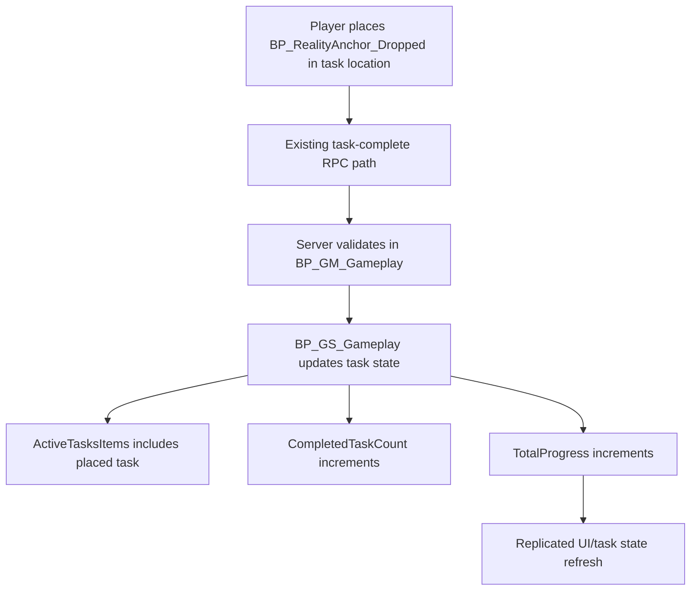
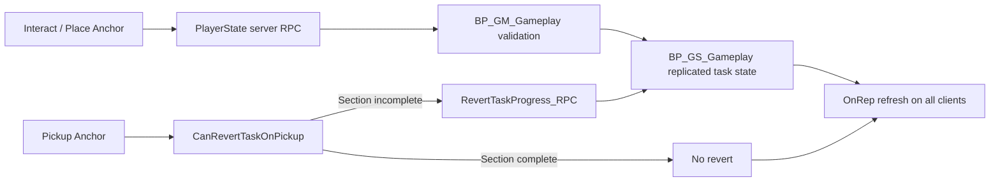

# Section Task Completion & Anchor Pickup Revert

This page extends the existing task replication workflow with **section-aware anchor behavior** while reusing current variables in `BP_GS_Gameplay` and `BP_GM_Gameplay`.

## Existing Variables Reused

### `BP_GS_Gameplay`
- `ActiveTasksItems` (Array of `BP_Task_Item_Base`)
- `CompletedTasksOfTaskIds` (Array of Name)
- `TotalProgress` (Integer)
- `LocalProcessedTasks` (Array of Name)

### `BP_GM_Gameplay`
- `CompletedTaskCount` (Integer)
- `RequiredTaskCount` (Integer)

## Section Lock Rule

No per-section map is added. Section lock state is inferred from existing counters:

```text
IsSectionComplete = (CompletedTaskCount >= RequiredTaskCount)
```

- **False**: section is still active; anchor pickup may revert placed task progress.
- **True**: section is complete/locked; anchor can be moved without reversion.

---

## 1) Anchor Placement Flow (Section Incomplete)



---

## 2) Anchor Pickup Revert Flow (Section Still Incomplete)

```mermaid
flowchart TD
    A[Anchor picked up] --> B[BP_RealityAnchor_Dropped checks CanRevertTaskOnPickup(TaskID)]
    B --> C{CompletedTaskCount < RequiredTaskCount?}
    C -- Yes --> D[Call RevertTaskProgress_RPC on server]
    D --> E[Find task in ActiveTasksItems by TaskID]
    E --> F[Remove task reference from ActiveTasksItems]
    F --> G[CompletedTaskCount decrements]
    G --> H[TotalProgress decrements]
    H --> I[Optional entropy increase]
    I --> J[Replicate reverted state + refresh tablet/UI]
```

---

## 3) Anchor Pickup No-Revert Flow (Section Complete)

```mermaid
flowchart TD
    A[Anchor picked up] --> B[CanRevertTaskOnPickup(TaskID)]
    B --> C{CompletedTaskCount < RequiredTaskCount?}
    C -- No --> D[Do not call RevertTaskProgress_RPC]
    D --> E[Task remains complete]
    E --> F[Anchor is free to move to next location]
```

---

## 4) Integration With Existing Replication Workflow



## Blueprint-Level Additions

### `BP_GS_Gameplay`
- Add **Server RPC**: `RevertTaskProgress_RPC(TaskID or TaskRef)`
  - Locate the task in `ActiveTasksItems` by Task ID
  - Remove it from `ActiveTasksItems`
  - Decrement `CompletedTaskCount`
  - Decrement `TotalProgress`
  - Optionally trigger entropy increase

### `BP_RealityAnchor_Dropped`
- On pickup:
  - Cast to GameState
  - Call helper `CanRevertTaskOnPickup(TaskID)`:
    - Returns `CompletedTaskCount < RequiredTaskCount`
  - If `true`, call `RevertTaskProgress_RPC`
  - If `false`, do nothing (no revert)
  - Trigger tablet/UI refresh path if needed

## Notes

- This preserves the existing RPC/replication architecture.
- No new section tracking data structures are introduced.
- The same completion counter (`CompletedTaskCount`) drives both end-condition checks and pickup-revert eligibility.
